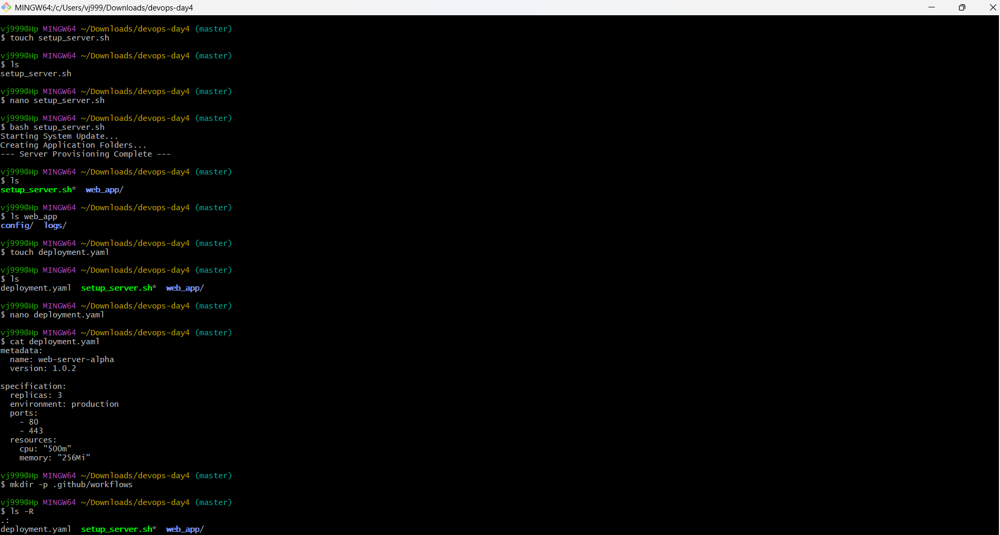
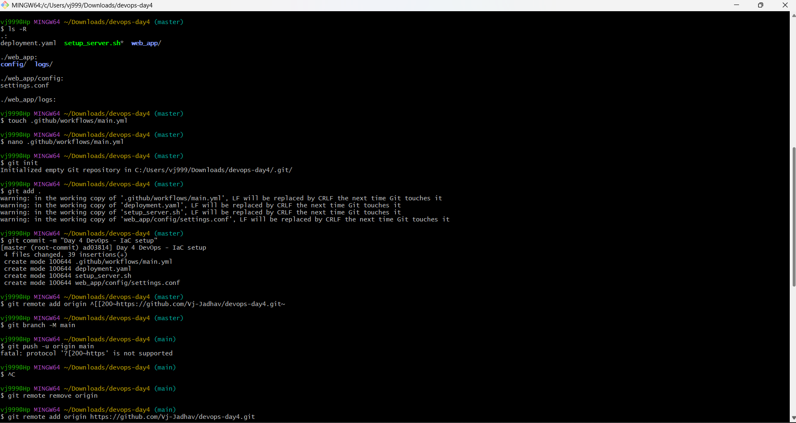

(Attach screenshot of terminal after running setup_server.sh)
## Day 4: Infrastructure Automation (IaC)

### 🔹 Difference between .sh and .yaml

**Shell Script (.sh):**

* Used for performing actions
* Executes commands step-by-step
* Example: Creating folders, installing packages

**YAML File (.yaml):**

* Used for defining infrastructure
* Describes desired state of system
* Example: Number of servers, ports, CPU, memory

---

### 🔹 Screenshot

---

### 🔹 Reflection

Manual setup for 100 servers is slow and error-prone.
Using scripts and YAML, we can automate the process, making it faster, consistent, and scalable.
Infrastructure as Code ensures that the same setup can be repeated without mistakes.

---
